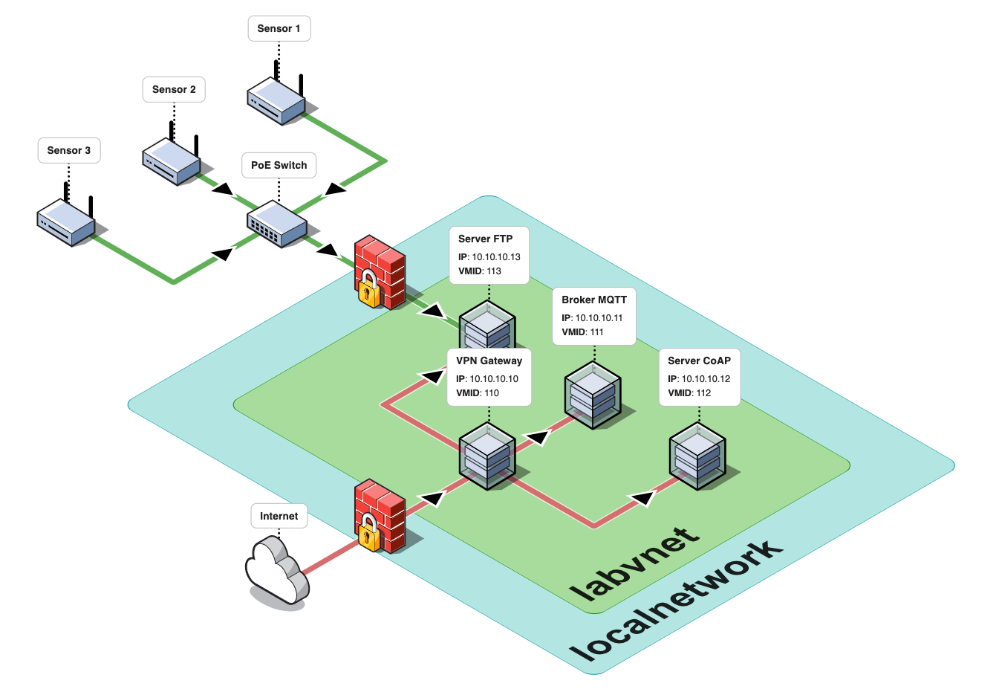
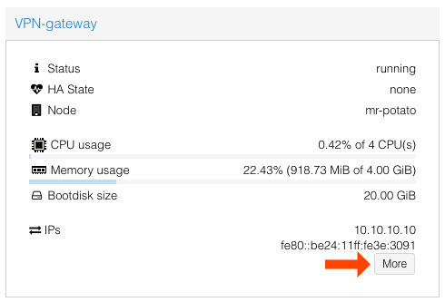

<!-- PROJECT LOGO -->
<br />
<div align="center">
  <a href="https://github.com/GiovanniBaccichet/ANT-net">
    
  </a>

  <h3 align="center">ANT Net</h3>

  <p align="center">
    Infrastructure as Code (IaC) for Advanced Network Technologies (ANT) Educational Lab
    <br />
    <a href="https://antlab.deib.polimi.it/"><strong>ANT Lab Website »</strong></a>
    <br />
    <br />
  </p>
</div>


<!-- ABOUT THE PROJECT -->
## About The Project

ANT-Net is a self deployable virtual infrastructure that hosts different services that are used in different courses at Politecnico di Milano. In particular it hosts:
- **VPN Gateway**:  [Wireguard](https://www.wireguard.com/) server w/ web interface for managing users and remote access to the infrastructure
- **MQTT Broker**:  [EMQX](https://www.emqx.com/en) server with web interface for managing topics and clients
- **CoAP Server**: Python-based CoAP server
- **File Server + Sensor Network**: a RPi network sending wireless data to a centralized file management service

The diagram below shows the logical organization of the virtual infrastructure, and in particular how the network is segmented to prevent users from communicating with machines on the outside of the virtual lab network.



<p align="right">(<a href="#readme-top">back to top</a>)</p>


### Built With

The project is build around  [Proxmox](https://www.proxmox.com/en/). The deployment of VMs is performed through  [Hashicorp Terraform](https://www.terraform.io/), using the [Terraform Provider for Proxmox](https://github.com/bpg/terraform-provider-proxmox) (we tested it with version 0.65.0). Despite being very well documented, said provider lacks some features regarding Proxmox templating and networking, and for that reason I added the scripts in `scripts/`. Additionally, the VM configuration is performed with the scripts in `scripts/vm_configuration`, this since every configuration is very simple, and it would have been totally overkill to use a tool like Ansible.

<p align="right">(<a href="#readme-top">back to top</a>)</p>


<!-- GETTING STARTED -->
## Getting Started

The main goal of this project being a reproducible and easy-to-deploy setup, most of the configurations are automatic and require little to none user interaction.

### Prerequisites

To successfully deploy the infrastructure, ensure you meet the following requirements:

1. **Proxmox Server**  
   - A computer running  [Proxmox Virtual Environment](https://www.proxmox.com/) (tested on version 8.2).  
   - Ensure that the server is connected to the internet and has at least one separate Network Interface Card (NIC).

2. **Network Interface Configuration**  
   - **Motherboard NIC**: Reserved for internet access and Proxmox management - will be `vmbr0`.  
   - **PCIe NIC**: Dedicated to the *VPN-Gateway* virtual machine. This NIC should be configured to be passed through to the VM and exposed publicly for VPN access.

3. **Additional Requirements**  
   - Sufficient resources (CPU, RAM, and storage) to run the Proxmox environment and the planned virtual machines - in the base config, at least 8 CPU cores and 16 GB RAM.  
   - Access to a computer or device with Terraform installed ( [Terraform installation guide](https://developer.hashicorp.com/terraform/tutorials)).  
   - SSH keys for secure access to Proxmox and other virtual machines will be configured in the next step.

4. **Terraform Environment**  
   - Terraform (version 1.9.8 or later, tested with version 1.9.8).  
   - The Terraform Proxmox provider configured. Install it via `terraform init` using the provided `proxmox` provider in this repo's `main.tf`.  


### Proxmox Authentication

The Terraform Proxmox provider uses API Token Key authentication. Before starting we need to create a user and generate an API token for that user (more info [here](https://registry.terraform.io/providers/bpg/proxmox/latest/docs)). For this project, user creation, permissions, API Token generation and SSH keys are managed using `scripts/ssh_api_token_setup.sh`.

**It is mandatory to execute that script** - or generate manually a user, assign the correct permissions and generate an API Token - **before proceeding**. It will output the SSH keys, both public and private, in `ssh`, and will output in CLI the Proxmox API Token, which must be copied and will be used by Terraform as authentication.

Inside `terraform/terraform.tfvars` put the output of the script, it should be something like:

```
api_token = "terraform@pve!provider=xxxxxxxx-xxxx-xxxx-xxxx-xxxxxxxxxxxx"
```

### Installation

To deploy and configure the machine, ensure you have the following at hand:  
- **API Token** (generated in the previous step) 
- **Proxmox root password**  

Follow these steps: 

#### 1. Configure `variables.tf`
Edit the `terraform/variables.tf` file to include your configuration details, such as the Proxmox host's IP address and hostname. Below is an example of what the file might look like:

```hcl
variable "proxmox_host" {
  default = "HOSTNAME_HERE"
}

variable "proxmox_host_ip" {
  default = "10.79.5.250"
}

variable "api_url" {
  default = "https://10.79.5.250:8006/api2/json"
}
```

#### 2. Populate `terraform.tfvars`

Update the `terraform/terraform.tfvars` file with your API Token and Proxmox root password. This step is crucial as the [Terraform Provider for Proxmox](https://github.com/bpg/terraform-provider-proxmox) relies on both token-based and password-based authentication. Here's a template to guide you:

```hcl
api_token = "terraform@pve!provider=xxxxxxxx-xxxx-xxxx-xxxx-xxxxxxxxxxxx"
username = "root@pam"
password = "PASSWORD_HERE"
```

#### 3. Configure Default VM Password

> [!CAUTION]  
> The **default** credentials for the VM template are `antlab/antlab`.

To set the **default** username and password for the VM template, edit the `terraform/modules/vm-template/main.tf` file. Locate the following section:

```hcl
user_account {
  username = "antlab"
  keys     = [trimspace(data.local_file.ssh_public_key.content)]
  password = "antlab"
}
```

This block specifies:
- The **username** (antlab)
- The **password** (antlab)
- The **SSH keys**, which are automatically configured based on the script in the [Proxmox Authentication](#proxmox-authentication) section.

> [!TIP]  
> During the creation of each VM, a random password is automatically generated and stored as a Terraform output. To view the generated password, use the following command: `terraform output -json` 

#### 4. Initialize and Apply Terraform

Once the configuration files are updated, navigate to the `terraform/` directory and run the following commands to initialize and apply the Terraform configuration:

```bash
terraform init
terraform apply --auto-approve
```

This process will download and configure the provider, then deploy the configuration. Note: The deployment may take 15-20 minutes.

For convenience, you can use this one-liner:

```bash
terraform init && terraform apply --auto-approve
```


<p align="right">(<a href="#readme-top">back to top</a>)</p>

<!-- USAGE EXAMPLES -->
## Usage

### Remote Access

> [!NOTE]  
> The virtual infrastructure is completely isolated from the rest of the network. It cannot be accessed or communicate outside of its subnet. To connect to this network, you must use a VPN.

As a backup access method, we use  [WireGuard](https://www.wireguard.com/), a high-performance, modern VPN protocol designed for simplicity and speed.

To manage WireGuard, we use  [WGDashboard](https://github.com/donaldzou/WGDashboard), an open-source project that provides an intuitive dashboard for managing:  
- Virtual networks  
- Peer configurations  
- Permissions  
- Bulk creation and deletion of users  

This dashboard streamlines the administration of the VPN gateway, ensuring efficient management of user access and network configurations.

To find the local IP address of the VPN, in order to access the segregated subnet, one can use the Proxmox web dashboard, accessing the `VPN-gateway` section:



> [!NOTE] 
> When specifying the VPN configuration, ensure that you do not use the IP address from the segregated subnet. Instead, use the IP address assigned to the other network interface (NIC).  

In this example, the NIC `ens16` has an IP address in the `10.79.0.0/24` subnet (and **not** the `10.10.10.10` one), which in production should be the public-facing NIC.

#### Sharing VPN Configurations

To distribute VPN configurations (e.g., to students in a course), follow these steps:

1. **Bulk Create Configurations**: Use **WGDashboard** to **bulk create** the desired number of VPN configurations.

2. **Download and Prepare Configurations**:  
   - Download all the peer configuration files from WGDashboard.  
   - Place these files into a folder (e.g., `vpn-profiles`).  
   - Prepare a `.CSV` file (`users.csv`) containing the details of the users you want to share the configurations with.  

3. **Run the Script**: use the provided script, `scripts/vpn-user-list.py`, to associate each configuration with a user and prepare a distribution-ready file.

   The script will:  
   - Match each VPN configuration to a user from `users.csv`.  
   - Generate an updated `.CSV` that can be used to bulk send the configurations via tools like the Microsoft Office Word **Mailings** feature.  

   Example structure for `users.csv`, and the *added VPN config (in italic)*:

   | Name       | Email                | Additional Info | *Profile Name*    | *VPN Config*                |
   | ---------- | -------------------- | --------------- | ----------------- | --------------------------- |
   | John Doe   | john.doe@email.com   | ...             | *BulkPeer#160...* | "[Interface] PrivateKey..." |
   | Jane Smith | jane.smith@email.com | ...             | ...               | ...                         |

By automating the process, you can efficiently distribute VPN profiles to a large number of users.

The script will recognize the original headers, and append new columns to the original data. Files and folders must be specified using command line arguments: 

```bash
python3 vpn-user-list.py [-o output.csv] [-p profiles-folder-path] input.csv
```  

### MQTT Broker

As previously mentioned, we use  [EMQX](https://www.emqx.com/en) as the MQTT Broker.  

**Why EMQX?**  

- It is a widely recognized **industry standard** for MQTT broker implementations.  
- Known for its **stability** and **reliability** when handling large amounts of network traffic.  
- Provides a **comprehensive web interface** to monitor and manage activity effectively.

---

#### Access Details

1. **Web Interface**:  
   After connecting to the VPN, the EMQX web interface can be accessed at:  
   `http://10.10.10.11:18083`

2. **Pub/Sub Functionality**:  
   For publishing and subscribing to MQTT topics, use the default port:  
   `1883`

---

Make sure the VPN connection is active before attempting to access the web interface or pub/sub functionalities.

### CoAP Server

We use a custom CoAP server based on CoAPthon.

### File Server

File server is used to collect data from sensor nodes.

<p align="right">(<a href="#readme-top">back to top</a>)</p>

## Additional Information

More info here, like firewall configs.

<p align="right">(<a href="#readme-top">back to top</a>)</p>

<!-- ROADMAP -->
## Roadmap

- [x] Automatically configure networking
- [x] Automatically generate API Token
- [x] Download and patch Ubuntu Cloud image w/ `qemu-guest-agent`
- [x] Deploy VMs
- [x] Deploy firewall rules 
- [x] Provision VMs
  - [x] VPN Gateway
  - [x] MQTT Broker
  - [x] CoAP Server
  - [x] File Server
- [x] Stress test the infrastructure

See the [open issues](https://github.com/GiovanniBaccichet/ANT-net/issues) for a full list of proposed features (and known issues).

<p align="right">(<a href="#readme-top">back to top</a>)</p>


<!-- CONTRIBUTING -->
## Contributing

Contributions are what make the open source community such an amazing place to learn, inspire, and create. Any contributions you make are **greatly appreciated**.

If you have a suggestion that would make this better, please fork the repo and create a pull request. You can also simply open an issue with the tag "enhancement".
Don't forget to give the project a star! Thanks again!

1. Fork the Project
2. Create your Feature Branch (`git checkout -b feature/AmazingFeature`)
3. Commit your Changes (`git commit -m 'Add some AmazingFeature'`)
4. Push to the Branch (`git push origin feature/AmazingFeature`)
5. Open a Pull Request


<!-- LICENSE -->
## License

Distributed under the GPLv3 License. See `LICENSE` for more information.

<p align="right">(<a href="#readme-top">back to top</a>)</p>


<!-- CONTACT -->
## Contact

Giovanni Baccichet - `giovanni.baccichet@polimi.it`

Project Link: [https://github.com/GiovanniBaccichet/ANT-Net](https://github.com/GiovanniBaccichet/ANT-Net)

<p align="right">(<a href="#readme-top">back to top</a>)</p>